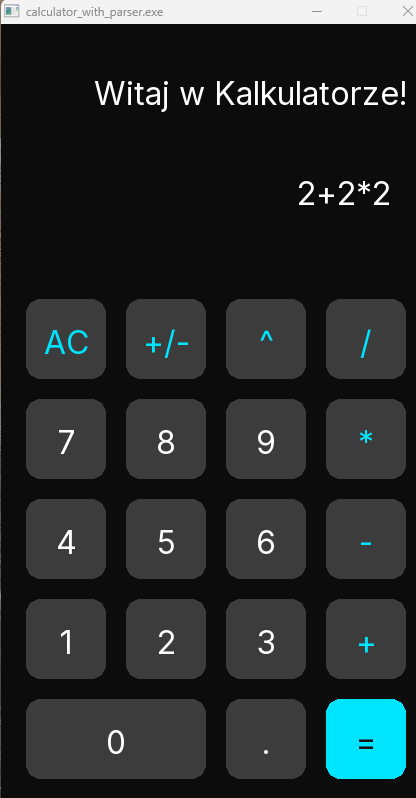

# GUI Calculator in C



A simple, fully functional desktop calculator written in C. It uses the **Allegro 5** library for the graphical user interface and a custom **recursive descent parser** to evaluate mathematical expressions.

## ✨ Features
* Interactive graphical interface with custom mouse hit-testing.
* Math engine that respects operator precedence (Exponentiation `^`, Multiplication/Division `*` `/`, Addition/Subtraction `+` `-`).
* Preventing division by zero.

## 🛠️ How to build (Windows)
To compile this project from source, you need the [MSYS2](https://www.msys2.org/) environment.

1. Open your **MSYS2 UCRT64** terminal (yellow icon).
2. Install the required compiler, Make, and the Allegro 5 library:
    ```bash
   pacman -S mingw-w64-ucrt-x86_64-gcc make mingw-w64-ucrt-x86_64-allegro
   ```
3. Clone this repo and navigate to the project folder
4. Build the project using Make
5. Run the application:
    ```bash
    ./calculator_with_parser.exe
    ```